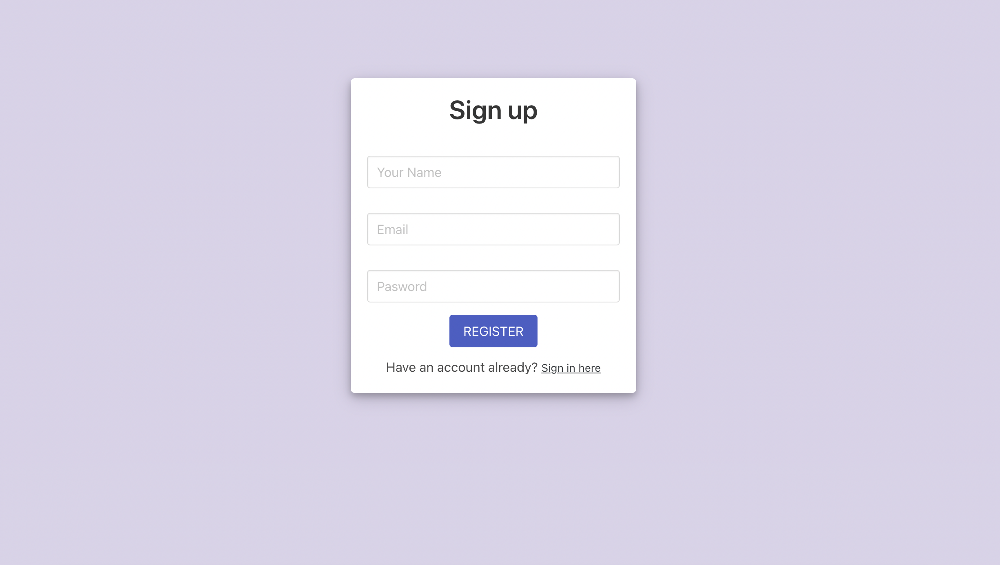

# Getting Started with Wallet Transactions


  


# Wallet Transactions


## Quick start

In the project directory, you can run:
```bash
npm install
# 
npm start
# 
npm build
```

## Modules Stack

```bash
npm install
# 
npm start
# 
npm build

rainbowkit
# 
bulma
# 
ethers
# 
firebase
# 
use-debounce
# 
wagmi
# 
testing-library
# 
button-vjover
```


## License

Licensed under the MIT License, Copyright © 2022-present [Rainbow](https://rainbow.me).

See [LICENSE](./LICENSE) for more information.